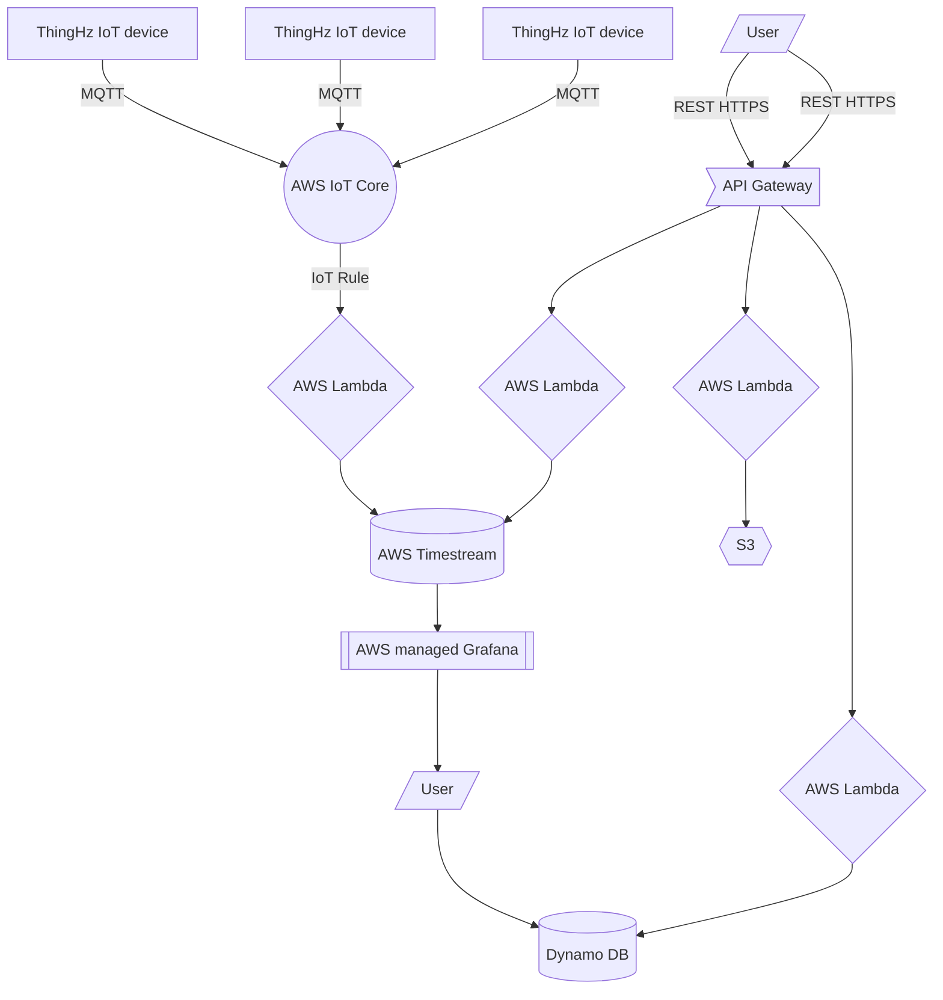

# ThingHz Mobile Application

**ThingHz** IoT backend is made using AWS serverless approach. AWS provides many microservices that can be knit together to form a robust and scalable infrastructure. I had prioritized some criteria for my cloud before choosing serverless which are as follows.

- **Robust**: My IoT infrastructure should be robust. It should be designed in a way to handle thousands of requests at a time
- **Scalable**: My IoT infrastructure should be scalable. It should be designed in a way to scale up automatically. It should be able to withstand any serge.

- **High Throughput**: My IoT infrastructure should have high throughput. It should be able to process a large number of reads and writes at a time without a long delay. 

# Features
- **Secure commisioning of devices**:  
QR code provisioning of devices. It provides secure provisioning of device using SSL device certificates using AWS IoT core APIs
- **Manage IoT devices effectively**:
User can effectivaly manage and fiter the devices on the basis of sensor profile, device status and esccalation levels
- **Real Time monitoring**: 
It helps user to monitor real time data form the device. Based on the sensor profile, user can categorize iot devices and can monitor different sensor parameters like temperature,  humidity, CO2 levels, Light intensity etc. This application uses MQTT pub-sub model to fetch data.
- **Automation**: Using this applcation user can control IoT devices remotely. User can automate lights,  irrigation, air flow etc. 
- **Analysis**: User can analyze data of the remote devices using graph and charts. 
- **Data Download**: User can download data of the devices from mobile applciation. This mobile application provides the feature to download 15days, 1 week and  2 days of data.
- **Record Keeping**: User can keep the records of his experiments, objectives and yiedl from ThingHz mobile application.  

I have used following services:
#### AWS IoT
AWS IoT handles all the device-side requests. It receives all the MQTT requests and processes them. AWS IoT is used for device provisioning and device management. It gives some initial analytics about the device's health. We are using the MQTT protocol. device publishes metadata, and device payload to AWS IoT, and then AWS IOT uses rules to relay these requests to Lambda.

#### AWS Lambda
We are using the AWS Lambda function as a set of our code blocks. In our case, AWS Lambda serves a variety of functions.

- Parsing MQTT data from AWS IoT and storing it into database.
- It is used to send push notification
- It is used to handle mobile and web HTTP requests.
- Handling device OTA

#### AWS Timestream
AWS Timestream is our timeseries database to store incoming data from devices. It can handle incoming writes precisely with nanoseconds frequency. In some cases, ThingHz devices send the data every second. To handle such a huge amount of requests timeseries database was the best option.

#### AWS API Gateway
AWS API gateway handles all the HTTP requests from mobile and web. it reads and writes all the HTTP requests from a client. AWS Lambda functions are used as the code block to handle all the API Gateway HTTP events.

#### AWS Dynamo DB
AWS Dynamo DB is a fully managed, serverless, NoSQL database. We are using Dynamo DB to store device metadata and user information. All the reads and writes for mobile and web apps are taken care of by dynamo DB.

#### AWS Grafana
AWS Grafana is an analytics and dashboard tool. We are using AWS Grafana as our web application to monitor device data. It gives us a variety of analytics tools, charts, graphs, etc to visualize our data. It lets you query, visualize, understand, and receive alerts about your metrics.

## Project FlowChart:

### ThingHz IoT Device
This device provides the real time monitoring and automation capabilities to indoor farm

Know more about ThingHz IoT devices in this [github repository](https://github.com/ThingHz/thinghz) 

## ThingHz Android
ThingHz android application, manages, contorl and monitor all the devices in the network. 
You can check out ThingHz android applciation in this [github repository](https://github.com/ThingHz/ThinghzAndroid).
